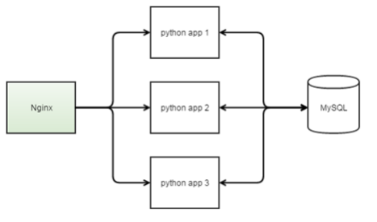

# MISVirtInfrastructure

This project demonstrate how to deploy [web-application](https://github.com/GRomR1/MovieInfoService) into docker-containers with all needed infrastructure.



## Getting Started

### Prerequisites

This project was tested on:
1. [CentOS Linux 7 x86_64](https://www.centos.org/)
2. [Docker CE 17.06.0](https://www.docker.com/)
3. [Docker Compose 1.14.0](https://docs.docker.com/compose/)

Thus you need something the same.

### Running

Use script **run.sh** for running this project and all components

```
./run.sh <number>
```

Where **\<number\>** - number of instances of a web application, e. g.:

```
./run.sh 3
```

Web-service is available on **<host_ip>**:80. 
Use [http://localhost/movies](http://localhost/movies) for get stored movies info (result is in JSON-format).

### Stop

If you need stop all services use script **stop.sh**.

## License

This project is licensed under the MIT License - see the [LICENSE](LICENSE) file for details
